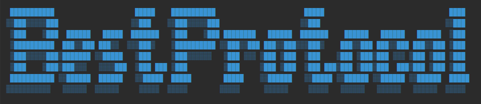

# BestProtocol Fullstack Software development project - Milton Friedman University

## Backend Dependencies

- Java Development Kit - JDK 17
- Spring Boot 3
- Spring Framework 6
- API contract - OPENAPI - Swagger 3

## Frontend Dependencies

## Backend build

# Backend structure

# Database - MySQL & MongoDB

# Discover Service in the MicroService Architecture

# GANTT diagram

